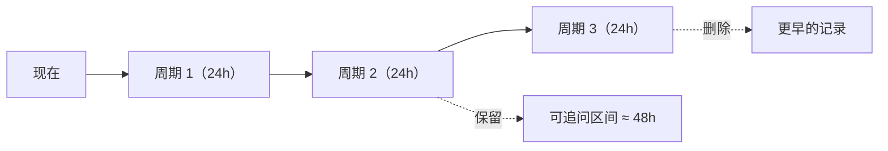

# 分析历史

每次分析成功后，Bot 会把**日志压缩包原文**与**追问上下文**归档到历史目录，并记录本次发出的全部消息 ID。

这样即使内存中的追问会话已过期，只要日志包还在保留期内，随时引用旧消息都能继续追问。

## 存储布局

```text
data/<配置名>/history/
  ├── records.json          # 全部记录的元数据（含消息 ID）
  └── <记录ID>/
      ├── source.zip        # 日志压缩包原文
      └── context.txt       # 追问上下文（日志摘要 + 代码参考）
```

## 保留策略（按周期，非滑动窗口）

每过一个 `history_period_hours` 检查一次，删除创建时间超过
`history_period_hours × history_keep_periods` 的记录。



默认 `1d` 周期、保留 `2` 周期 ⇒ 记录可存活 **2~3 天**，因此这段时间内上传过的日志都能继续追问。

> 清理任务默认每 3600s 执行一次（正常模式与调试模式都会启动）。
> `keep_periods <= 0` 时全部视为过期（用于 `purge`）。

## 相关设置

| 设置项 | 默认 | 说明 |
| --- | --- | --- |
| `history_enabled` | `true` | 是否归档分析历史 |
| `history_period_hours` | `24` | 保留周期（小时） |
| `history_keep_periods` | `2` | 保留多少个周期，超出即删除 |
| `history_max_records` | `200` | 记录条数安全上限（防磁盘写满） |
| `history_max_total_mb` | `4096` | 历史目录总大小安全上限 MB |

> ⚠️ **git 仓库缓存（`data/repos/`）不属于历史记录，永远不会被清理。**
> 清理只删除 `data/<配置名>/history/` 内部以记录 ID 命名的子目录（有路径越界校验）。

## 手动管理

| 指令 | 说明 |
| --- | --- |
| `/maa history` | 查看统计 |
| `/maa history clean` | 清理超期记录 |
| `/maa history purge` | 清空全部（后两者需写权限） |

设置 `history_enabled: false` 则完全不归档（追问仅限内存会话有效期）。
